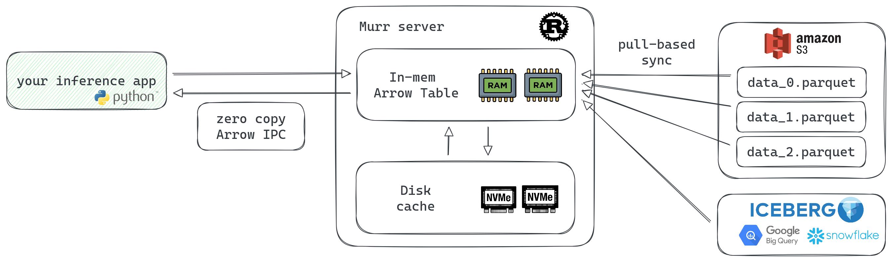

# Murr

[](https://github.com/shuttie/murr/actions)
[](https://opensource.org/licenses/Apache-2.0)


Columnar in-memory cache for AI inference workloads. A Redis replacement optimized for batch low-latency zero-copy feature retrieval.

## What is Murr?



Murr is a caching layer for ML feature serving that sits between your batch data pipelines and inference services:

- **Columnar storage**: Custom binary `.seg` format optimized for "give me columns X, Y, Z for keys 1-200" access patterns
- **Zero-copy reads**: Memory-mapped segments with direct byte-level access — no deserialization overhead
- **Pull-based sync**: Workers poll S3 for new Parquet partitions and reload automatically
- **Stateless**: No primary/replica coordination, just point at S3 and scale horizontally
- **Content-negotiated API**: JSON for debugging, Arrow IPC for production — maps directly to `np.ndarray` and `torch.Tensor`
- **Single-binary**: Written in Rust, deploys as one binary with a YAML config

## Why Murr?

ML inference often requires fetching features for hundreds of documents per request. A ranking model scoring 200 candidates with 40 features each needs 8000 values in milliseconds. Existing solutions weren't built for this:

* **Redis** uses row-oriented storage. With Feast-style HSET layouts, each feature is a separate hash field, so fetching 40 features x 200 docs = 8000 hash lookups. Even with pipelining, this adds 50-100ms latency. Packing features into blobs helps reads but makes atomic updates complex.

* **DynamoDB** charges per request. High-throughput inference becomes expensive quickly.

* **Local RocksDB** is fast but operationally heavy. You need pipelines to build DB files, distribute them to pods, and coordinate reloads. Storage costs multiply with replica count.

Simple, fast, cheap — you can choose only two.

Murr is designed around the batch read pattern from the start. Data lives in a custom columnar segment format, so "give me columns X, Y, Z for keys 1-200" is a single scatter-gather operation, not thousands of lookups. Workers pull Parquet files from S3 on startup — no ingestion pipelines, no coordination. Responses support Arrow IPC, which maps directly to NumPy arrays without re-encoding.

### Benchmarks

Batch feature lookup: 10M rows, 10 Float32 columns, fetching 1000 random keys per request.

- **Murr**: full HTTP round-trip returning Arrow IPC streaming response
- **Redis MGET**: all columns packed into a single binary blob per key, fetched with pipelined MGET
- **Redis Feast**: one HSET per key with a field per column (standard Feast layout), fetched with pipelined HGETALL

| Approach | Latency (p50) | Throughput |
|----------|---------------|------------|
| Murr (HTTP + Arrow IPC) | 140 µs | 7.15 Mkeys/s |
| Redis MGET (feature blobs) | 263 µs | 3.80 Mkeys/s |
| Redis Feast (HSET per row) | 3.80 ms | 263 Kkeys/s |

Murr is ~1.9x faster than the best Redis layout (MGET with packed blobs) and ~27x faster than Feast-style hash-per-row storage.


## Status

**Pre-alpha. Here be dragons.**

The storage engine, service layer, and REST API are implemented and working. Data loading from S3 and the Python client are not yet built.

## Architecture

### Storage Engine

The storage subsystem is a custom columnar format inspired by Apache Lucene's immutable segment model:

- **Segments** (`.seg` files) are the atomic unit of write — one batch of data becomes one immutable segment. Segments are never modified in place, which simplifies concurrency and maps naturally to object storage.
- **Directory abstraction** decouples logical data organization from physical storage (local filesystem now, S3 later).
- **Memory-mapped reads** via `memmap2` — the OS manages page caching, segment data is accessed as zero-copy byte slices.
- **Last-write-wins** key resolution: newer segments shadow older ones for the same key, enabling incremental updates without rewriting history.

Segment wire format:
```
[MURR magic (4B)][version u32 LE]
[column payloads, 4-byte aligned]
[footer entries: name_len|name|offset|size per column]
[footer_size u32 LE]
```

The footer-at-the-end layout (reader seeks to end first to find metadata) follows the same pattern as Lucene's compound file format.

### Column Types

Each column type has its own binary encoding optimized for scatter-gather reads:

| Type | Status | Description |
|------|--------|-------------|
| `float32` | Implemented | 16-byte header, 8-byte aligned f32 payload, optional null bitmap |
| `utf8` | Implemented | 20-byte header, i32 value offsets, concatenated strings, optional null bitmap |
| `int16`, `int32`, `int64`, `uint16`, `uint32`, `uint64`, `float64`, `bool` | Planned | Declared in config schema |

Null bitmaps use u64-word bit arrays (bit set = valid). Non-nullable columns skip bitmap checks entirely — benchmarks showed this returns performance to the no-nulls baseline.

### REST API

| Method | Path | Description |
|--------|------|-------------|
| GET | `/health` | Health check |
| GET | `/openapi.json` | OpenAPI spec |
| GET | `/api/v1/table` | List all tables with schemas |
| GET | `/api/v1/table/{name}/schema` | Get table schema |
| PUT | `/api/v1/table/{name}` | Create a table |
| POST | `/api/v1/table/{name}/fetch` | Read data (JSON or Arrow IPC response) |
| PUT | `/api/v1/table/{name}/write` | Write data (JSON or Arrow IPC request) |

**Content negotiation**: Fetch responses use `Accept` header (`application/json` or `application/vnd.apache.arrow.stream`). Write requests use `Content-Type` header for the same formats.

### Performance

At 10M rows, 10 Float32 columns, 1000 random key lookups:

- Key index lookup: ~2-3us (AHash + string comparison in AHashMap)
- Value gather per column: ~3-4us (random memory access into mmapped segments)
- Null bitmap overhead: near-zero for non-nullable columns
- Total scatter-gather: ~30-40us

Key optimizations discovered through systematic benchmarking:
- **AHashMap** (AES-NI based) reduced hashing overhead from 26% to ~2% of query time
- **Two-loop gather** (values then bitmap separately) preserves `.collect()`/`extend_trusted` compiler optimization — fusing into one loop forces `push()` which is significantly slower
- **Branch-once null checking**: check nullability at segment level, not per element
- **`bytemuck`** for zero-copy casting of segment headers

## Quick Start

Query features:

```bash
# JSON format (for debugging)
curl -X POST http://localhost:8080/api/v1/table/user_features/fetch \
  -H "Content-Type: application/json" \
  -d '{"keys": ["user_1", "user_2", "user_3"], "columns": ["click_rate_7d", "purchase_count_30d"]}'

# Arrow IPC format (for production)
curl -X POST http://localhost:8080/api/v1/table/user_features/fetch \
  -H "Content-Type: application/json" \
  -H "Accept: application/vnd.apache.arrow.stream" \
  -d '{"keys": ["user_1", "user_2", "user_3"], "columns": ["click_rate_7d", "purchase_count_30d"]}' \
  --output response.arrow
```

Python client (planned):

```python
from murr import Client

client = Client("http://localhost:8080")
batch = client.get("user_features",
    keys=["user_1", "user_2", "user_3"],
    columns=["click_rate_7d", "purchase_count_30d"]
)

# Direct conversion to numpy/torch
features = batch.to_numpy()  # dict[str, np.ndarray]
tensor = batch.to_torch()    # dict[str, torch.Tensor]
```

## Development

```bash
cargo build                  # Build the project
cargo test                   # Run all tests
cargo check                  # Fast syntax/type check
cargo clippy                 # Linting
cargo fmt                    # Format code
cargo bench --bench <name>   # Run a benchmark (hashmap_bench, hashmap_row_bench)
```

## Roadmap

- Data loading from S3/local Parquet files
- Additional column types (int32, int64, float64, bool, etc.)
- Memory-mapped storage backend for larger-than-RAM datasets
- Python client library
- Prometheus metrics
- Iceberg catalog support (BigQuery, Snowflake, AWS Glue)

## License

Apache 2.0
