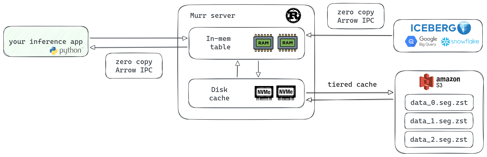
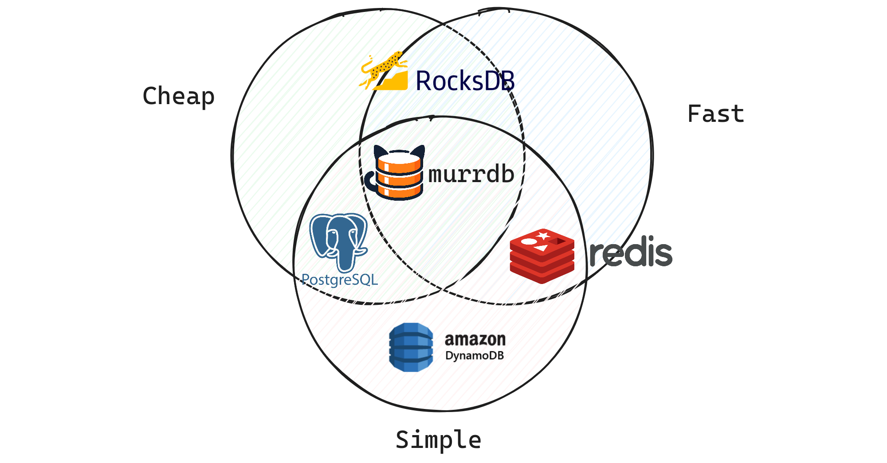

[](https://github.com/shuttie/murr/actions)
[](https://opensource.org/licenses/Apache-2.0)


<p align="center">
<a href="#what-is-murr">🐱 What is Murr?</a> &middot; <a href="#why-murr">🚀 Why Murr?</a> &middot; <a href="#why-not-murr">🚫 Why NOT Murr?</a> &middot; <a href="#quickstart">⚡ Quickstart</a> &middot; <a href="#benchmarks">📊 Benchmarks</a> &middot; <a href="#roadmap">🗺 Roadmap</a>
</p>

**Murrdb**: A columnar in-memory cache for AI inference workloads. A faster Redis/RocksDB replacement, optimized for batch low-latency zero-copy reads and writes.

> This `README.md` is 99%[^1] human written.

[^1]: Used only for grammar and syntax checking.


## What is Murr?



Murr is a caching layer for ML/AI data serving that sits between your batch data pipelines and inference apps:

- **Tiered storage**: hot data lives in memory, cold data stays on disk with S3-based replication. It's 2026, RAM is expensive - keep only the hot stuff there.
- **Batch-in, batch-out**: native batch reads and writes over columnar storage, with no per-row overhead. Dumping 1GB Parquet/Arrow files into the ingestion API is a perfectly valid use case.
```shell
# yes this works for batch writes
curl -d @0000.parquet -H "Content-Type: application/vnd.apache.parquet" \
  -XPUT http://localhost:8080/api/v1/table/yolo/write
```
- **Zero-copy wire protocol**: no conversion needed when building `np.ndarray`, `pd.DataFrame` or `pt.Tensor` from API responses. Sure, Redis is fast, but parsing its replies is not (especially in Python!).
```python
result = db.read("docs", keys=["doc_1", "doc_3", "doc_5"], columns=["score", "category"])
print(result.to_pandas())  # look mom, zero copy!
```
- **Stateless**: Murr is not a database - all state is persisted on S3. When a Redis node gets restarted, you're cooked. Murr just self-bootstraps from block storage.

Murr shines when:
* **your data is heavy and tabular**: that giant Parquet dump on S3 your AI inference or ML prep job produces? Perfect fit.
* **reads are batched**: pulling 100 columns across 1000 documents your agent wants to analyze? Great!
* **you care about costs**: sure, Redis with 1TB of RAM will work fine, but disk/S3 offloading is operationally simpler and way cheaper.

Short quickstart (see [full example](#quickstart)):
```shell
uv pip install murrdb
```
and then
```python
from murr.sync import Murr

db = Murr.start_local(cache_dir="/tmp/murr")  # embedded local instance

# fetch columns for a batch of document keys
result = db.read("docs", keys=["doc_1", "doc_3", "doc_5"], columns=["score", "category"])
print(result.to_pandas())

# Output:
#    score category
# 0   0.95       ml
# 1   0.72    infra
# 2   0.68      ops
```

## Why Murr?

TLDR: latency, simplicity, cost -- pick two. Murrdb tries to nail all three: fastest, cheapest, and easiest to operate. A bold claim, I know.



For the typical use case of `read N datapoints across M documents` (an agent reading document attributes, an ML ranker fetching feature values), on top of being the fastest, Murrdb:
- vs **[Redis](https://redis.io/)**: is persistent (S3 is the new filesystem) and can offload cold data to local NVMe.
- vs embedded **[RocksDB](https://rocksdb.org/)**: no need to build data sync between producer jobs and inference nodes yourself. Murrdb was designed to be distributed from the start.
- vs **[DynamoDB](https://aws.amazon.com/dynamodb/)**: roughly 10x cheaper, since you only pay for CPU/RAM, not per query.

Not being a general-purpose database, it tries to be friendly to the everyday pain points of ML/AI engineers:
* **First-class Python support**: `pip install murrdb`, then map to/from Numpy/Pandas/Polars/Pytorch arrays with zero copy.
* **Sparse columns**: when a column has no data, it takes up zero bytes. Unlike the packed feature blob approach, where null columns aren't actually null.

## Why NOT Murr?

Murr is not a general-purpose database:
* **OLTP workloads**: if you have relations, transactions, and per-row reads/writes, go with [Postgres](https://www.postgresql.org/).
* **Analytics**: aggregating over entire tables to produce reports? Pick [Clickhouse](https://clickhouse.com/), [BigQuery](https://cloud.google.com/bigquery), or [Snowflake](https://www.snowflake.com/).
* **General-purpose caching**: need to cache user session data for a web app? Use [Redis](https://redis.io/).
* **Feature store**: yes, it kinda looks like one — but Murrdb doesn't govern how you compute and store your data. Murr is an online serving layer, and can be a part of both internal feature stores and open-source ones like [Feast](https://feast.dev/), [Hopsworks](https://www.hopsworks.ai/), and [Databricks Feature Store](https://docs.databricks.com/en/machine-learning/feature-store/index.html).

> [!WARNING]
> Murr is still in its early days and may not be stable enough for your use case yet. But it's improving quickly.

## Quickstart

```python
import pandas as pd
import pyarrow as pa
from murr import TableSchema, ColumnSchema, DType
from murr.sync import Murr

db = Murr.start_local(cache_dir="/tmp/murr")

# define table schema
schema = TableSchema(
    key="doc_id", # the key
    columns={
        "doc_id": ColumnSchema(dtype=DType.UTF8, nullable=False),
        "score": ColumnSchema(dtype=DType.FLOAT32),
        "category": ColumnSchema(dtype=DType.UTF8),
    },
)
db.create_table("docs", schema)

# write a batch of documents
df = pd.DataFrame.from_dict({
    "doc_id":   ["doc_1", "doc_2", "doc_3", "doc_4", "doc_5"],
    "score":    [0.95, 0.87, 0.72, 0.91, 0.68],
    "category": ["ml", "search", "infra", "ml", "ops"],
})
db.write("docs", pa.Table.from_pandas(df))

# fetch specific columns for a few keys
result = db.read("docs", keys=["doc_1", "doc_3", "doc_5"], columns=["score", "category"])
print(result.to_pandas())

# Output:
#   score category
# 0   0.95       ml
# 1   0.72    infra
# 2   0.68      ops

```

## Benchmarks

We benchmark a typical `ML Ranking` use case: an ML scoring model running across `N=1000` documents, each with `M=10` `float32` feature values. Key distribution is random, on a small 10M row dataset.

* **murrdb**: modeled as a simple table with a `utf8` key and 10 non-nullable `float32` columns. We measure both Flight gRPC and HTTP protocols.
* **Redis** with feature-blob approach: all 10 per-document features packed into a 40-byte blob. Essentially a key-value lookup via `MGET`, all 1000 keys at once. Efficient, but good luck adding a new column.
* **Redis** with [Feast](https://feast.dev/)-style approach: each document is an HSET where the key is the feature name and the value is its value. Each feature can be read/written separately, but you need pipelining to get anywhere near MGET performance.

| Approach | Latency (mean)[^2] | 95% CI | Throughput |
|----------|----------------|--------|------------|
| Murr (HTTP + Arrow IPC) | 104 µs | [103—104 µs] | 9.63 Mkeys/s |
| Murr (Flight gRPC) | 105 µs | [104—105 µs] | 9.53 Mkeys/s |
| Redis MGET (feature blobs) | 263 µs | [262—264 µs] | 3.80 Mkeys/s |
| Redis Feast (HSET per row) | 3.80 ms | [3.76—3.89 ms] | 263 Kkeys/s |

Murr is ~2.5x faster than the best Redis layout (MGET with packed blobs) and ~36x faster than Feast-style hash-per-row storage.

[^2]: We measure last-byte latency and don't include protocol parsing overhead yet.

## Roadmap

No ETAs, but at least you can see where things stand:
- [x] HTTP API
- [x] Arrow Flight gRPC API
- [x] API for data ingestion
- [x] Storage Directory interface (which is heavily inspired by [Apache Lucene](https://lucene.apache.org/))
- [x] Segment read/writes (again, inspired by [Apache Lucene](https://lucene.apache.org/))
- [x] Python embedded murrdb, so we can make a cool demo
- [x] Benchmarking harness: Redis support, Feast and feature-blob styles
- [x] Win at your own benchmark (this was surprisingly hard btw)
- [x] Support for `utf8` and `float32` datatypes
- [ ] Python remote API client
- [ ] Docker image
- [ ] Support most popular Arrow numerical types (signed/unsigned int 8/16/32/64, float 16/64, date-time)
- [ ] Array datatypes (e.g. Arrow `list`), so you can store embeddings
- [ ] Sparse columns
- [ ] Add RocksDB and Postgres to the benchmark harness
- [ ] [Apache Iceberg](https://iceberg.apache.org/) and the very popular `parquet dump on S3` data catalog support


## Architecture

### Storage Engine

The storage subsystem is a custom columnar format heavily inspired by [Apache Lucene](https://lucene.apache.org/)'s immutable segment model:

- **[Segments](src/io/segment/)** (`.seg` files) are the atomic unit of write -- one batch of data becomes one immutable segment. No in-place modifications, which simplifies concurrency and maps naturally to object storage.
- **[Directory abstraction](src/io/directory/)** keeps logical data organization separate from physical storage (local filesystem for now, S3 later).
- **Memory-mapped reads** via [`memmap2`](https://crates.io/crates/memmap2) -- the OS takes care of page caching, segment data is accessed as zero-copy byte slices.
- **Last-write-wins** key resolution: newer segments shadow older ones for the same key, so you get incremental updates without rewriting old data.

<details>
<summary>Segment wire format</summary>

```
[MURR magic (4B)][version u32 LE]
[column payloads, 4-byte aligned]
[footer entries: name_len|name|offset|size per column]
[footer_size u32 LE]
```

The footer-at-the-end layout follows the same pattern as Lucene's compound file format.
</details>

<details>
<summary><h3>Column Types</h3></summary>

Each column type has its own binary encoding tuned for scatter-gather reads. We tried using Arrow for the in-memory representation early on, and it turned out surprisingly slow compared to a hand-rolled implementation:

| Type | Status | Description |
|------|--------|-------------|
| `float32` | Implemented | 16-byte header, 8-byte aligned f32 payload, optional null bitmap |
| `utf8` | Implemented | 20-byte header, i32 value offsets, concatenated strings, optional null bitmap |
| `int16`, `int32`, `int64`, `uint16`, `uint32`, `uint64`, `float64`, `bool` | Planned |   |

Null bitmaps are u64-word bit arrays (bit set = valid). Non-nullable columns skip bitmap checks entirely.
</details>

<details>
<summary><h3>REST API (port 8080)</h3></summary>

Served by the [Axum HTTP layer](src/api/http/).

| Method | Path | Description |
|--------|------|-------------|
| GET | `/health` | Health check |
| GET | `/openapi.json` | OpenAPI spec |
| GET | `/api/v1/table` | List all tables with schemas |
| GET | `/api/v1/table/{name}/schema` | Get table schema |
| PUT | `/api/v1/table/{name}` | Create a table |
| POST | `/api/v1/table/{name}/fetch` | Read data (JSON or Arrow IPC response) |
| PUT | `/api/v1/table/{name}/write` | Write data (JSON, Parquet or Arrow IPC request) |

Fetch responses respect the `Accept` header (`application/json` or `application/vnd.apache.arrow.stream`). Write requests use `Content-Type` for the same formats.
</details>

<details>
<summary><h3>Arrow Flight gRPC API (port 8081)</h3></summary>

A read-only [Arrow Flight](https://arrow.apache.org/docs/format/Flight.html) endpoint for native Arrow integration without the HTTP overhead. Source: [`src/api/flight/`](src/api/flight/).

| RPC | Description |
|-----|-------------|
| `do_get` | Fetch rows by keys and columns (JSON-encoded `FetchTicket`) |
| `get_flight_info` | Get table schema and metadata |
| `get_schema` | Get schema in Arrow IPC format |
| `list_flights` | List all available tables |

Ticket format for `do_get`:
```json
{"table": "user_features", "keys": ["user_1", "user_2"], "columns": ["click_rate_7d"]}
```
</details>

## Development

```bash
cargo build                  # Build the project
cargo test                   # Run all tests
cargo check                  # Fast syntax/type check
cargo clippy                 # Linting
cargo fmt                    # Format code
cargo bench --bench <name>   # Run a benchmark (table_bench, http_bench, flight_bench, hashmap_bench, hashmap_row_bench, redis_feast_bench, redis_featureblob_bench)
```

## License

Apache 2.0
